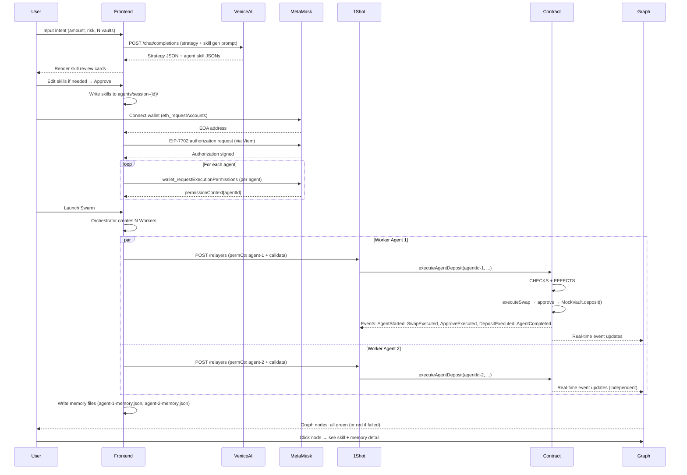

# API & Events — Vibing Farmer

> **Skill Reference:** api-integration-specialist
> **Version:** 2.0 | **Date:** May 27, 2026
> **Purpose:** Documentation of event models, API endpoints, payload schemas, and error handling

---

## 1. Event Model Summary

Vibing Farmer utilizes four external API sources and one on-chain event source:

| Source | Type | Purpose |
|--------|------|--------|
| Venice AI API | REST (OpenAI-compatible) | Strategy generation + skill auto-generation per agent |
| 1Shot Permissionless Relayer | REST (JSON-RPC) | Gas-free relay for all agent transactions |
| MetaMask Smart Accounts Kit | JSON-RPC via MetaMask Flask | EIP-7702 + ERC-7715 per-agent permission |
| AgentVaultDepositor Events | On-chain (Ethereum logs) | Real-time agent state updates → vis.js graph |

---

## 2. API & Event Reference

### Venice AI API

**Base URL:** `https://api.venice.ai/api/v1`

| Method | Endpoint | Description |
|--------|----------|-----------|
| POST | `/chat/completions` | Generate multi-vault strategy + skill sets per agent |
| GET | `/models` | List available models |

**Auth:** Bearer token in the `Authorization` header: `Authorization: Bearer {VENICE_API_KEY}`.

**Required Headers:**
```
Content-Type: application/json
Authorization: Bearer {VENICE_API_KEY}
```

---

### 1Shot Permissionless Relayer

**Base URL:** `https://relayer.1shotapi.com`  
**Auth:** No API key required — Permissionless Relayer.

| Method | Endpoint | Description |
|--------|----------|-----------|
| POST | `/relayers` | Submit relay request (JSON-RPC) for a single agent transaction |

**Note:** Each Worker Agent submits its own relay request. Relays cannot be batched for multiple agents because each agent has a unique permissionContext.

---

### MetaMask Smart Accounts Kit (JSON-RPC via window.ethereum)

| Method | Description |
|--------|-----------|
| `eth_requestAccounts` | Connect wallet + get EOA address |
| `wallet_requestExecutionPermissions` | ERC-7715: request scoped permission per agent |
| `wallet_revokePermissions` | Revoke granted permissions |
| EIP-7702 authorization | Authorize code for the EOA via Viem + MetaMask Flask |

---

### Smart Contract Events (`AgentVaultDepositor.sol`)

| Event | Parameters | Trigger | vis.js Update |
|-------|-----------|---------|--------------|
| `AgentStarted` | `agentId`, `user`, `vault` | Agent begins execution | Node: gray → blue |
| `SwapExecuted` | `agentId`, `user`, `amountIn`, `amountOut` | Swap succeeded | Edge swap confirmed |
| `ApproveExecuted` | `agentId`, `user`, `vault`, `amount` | Approve vault succeeded | Edge approve confirmed |
| `DepositExecuted` | `agentId`, `user`, `vault`, `amount`, `shares` | Deposit succeeded | Edge deposit confirmed |
| `AgentCompleted` | `agentId`, `user`, `vault`, `shares` | Agent completed all steps | Node: blue → green |
| `AgentFailed` | `agentId`, `user`, `reason` | Agent failed (scope violation or transaction error) | Node: any → red |

---

## 3. Complete Payload Schemas

### Venice AI — Strategy + Skill Generation Request

```json
{
  "model": "llama-3.3-70b",
  "response_format": { "type": "json_object" },
  "venice_parameters": { "include_venice_system_prompt": false },
  "messages": [
    {
      "role": "system",
      "content": "You are a DeFi strategy coordinator. Generate a multi-vault yield farming strategy and skill configurations for each agent. The output must be valid JSON matching the provided schema. Privacy-first: do not store user data."
    },
    {
      "role": "user",
      "content": "Total: 100 USDC. Risk: Low. Vault count: 2. Memory context from previous sessions: [{\"lesson\": \"MockVault A is reliable with 0.5% slippage\"}]. Generate strategy and agent skills."
    }
  ],
  "max_tokens": 800
}
```

### Venice AI — Expected Response

```json
{
  "strategy": [
    {
      "vaultAddress": "0xMockVaultA",
      "vaultName": "MockVault USDC-A",
      "amount": "50000000",
      "estimatedAPY": 7.8,
      "reasoning": "Vault A uses a conservative lending strategy. The risk profile is appropriate."
    },
    {
      "vaultAddress": "0xMockVaultB",
      "vaultName": "MockVault USDC-B",
      "amount": "50000000",
      "estimatedAPY": 8.2,
      "reasoning": "Vault B is historically stable with a higher APY. Risk is still acceptable."
    }
  ],
  "agents": [
    {
      "agentId": "worker-agent-1",
      "vault": "0xMockVaultA",
      "skills": {
        "swap": {
          "maxSlippage": 0.5,
          "dexPreference": "uniswap-v3",
          "maxRetries": 2,
          "timeoutSeconds": 30
        },
        "deposit": {
          "maxAmount": "50000000",
          "vaultAddress": "0xMockVaultA",
          "expiresAt": 1749686400
        }
      }
    },
    {
      "agentId": "worker-agent-2",
      "vault": "0xMockVaultB",
      "skills": {
        "swap": {
          "maxSlippage": 0.3,
          "dexPreference": "uniswap-v3",
          "maxRetries": 2,
          "timeoutSeconds": 30
        },
        "deposit": {
          "maxAmount": "50000000",
          "vaultAddress": "0xMockVaultB",
          "expiresAt": 1749686400
        }
      }
    }
  ]
}
```

---

### ERC-7715 — Permission Request per Agent

```json
{
  "method": "wallet_requestExecutionPermissions",
  "params": {
    "permissions": [
      {
        "type": "vault-deposit",
        "agentId": "0x<keccak256('worker-agent-1')>",
        "allowedVault": "0xMockVaultA",
        "maxAmount": "50000000",
        "currency": "USDC",
        "expiresAt": 1749686400
      }
    ]
  }
}
```

*Note: Call twice — once per agent. If MetaMask Flask supports batching, send an array of permissions.*

---

### 1Shot Relay — Request per Worker Agent

```json
{
  "jsonrpc": "2.0",
  "method": "relay",
  "params": {
    "permissionContext": "<ERC-7715 context from MetaMask Flask for the agentId>",
    "delegationManager": "<address from MetaMask SAK>",
    "calls": [
      {
        "to": "0xAgentVaultDepositorAddress",
        "data": "<encoded executeAgentDeposit(agentId, user, vault, amount) calldata>",
        "value": "0"
      }
    ]
  },
  "id": 1
}
```

---

### 1Shot Relay — Response

```json
{
  "jsonrpc": "2.0",
  "result": {
    "txHash": "0xTRANSACTION_HASH",
    "status": "pending"
  },
  "id": 1
}
```

---

## 4. Complete Sequence Diagram



---

## 5. Error Handling & Retry

| Scenario | Handling |
|----------|---------|
| Venice AI timeout (> 10 seconds) | Display hardcoded fallback strategy and skill template. Notify user. |
| Venice AI JSON malformed | Validate schema → display error "Strategy generation failed. Using fallback." |
| MetaMask Flask not installed | Display "Install MetaMask Flask 13.9+ to continue." |
| User rejects MetaMask popup | Reset UI to the previous state. |
| 1Shot relay fails (Worker N) | Worker N: retry once based on maxRetries skill. If it still fails, mark Worker N as failed. Other workers are unaffected. |
| Contract revert (permission exceeded) | Worker marks AgentFailed. Graph node turns red. Error details logged in memory and shown in node panel. No retry. |
| Worker Agent 1 fails | Workers 2 to N keep running (using Promise.allSettled). Only Worker 1 is marked as failed. |
| Network is not Sepolia | Display "Switch to Sepolia testnet." |
| vis.js graph fails to load | Fallback to a text-based step tracker list. |

**Retry Policy:**
- Venice AI: No auto-retry (user triggers retry manually)
- 1Shot relay per Worker: Retry once after 5 seconds on network error (guided by `maxRetries` skill)
- Contract revert: No retry (revert is final)
- Worker Agent failure: Does not affect other workers (handled via Promise.allSettled)
