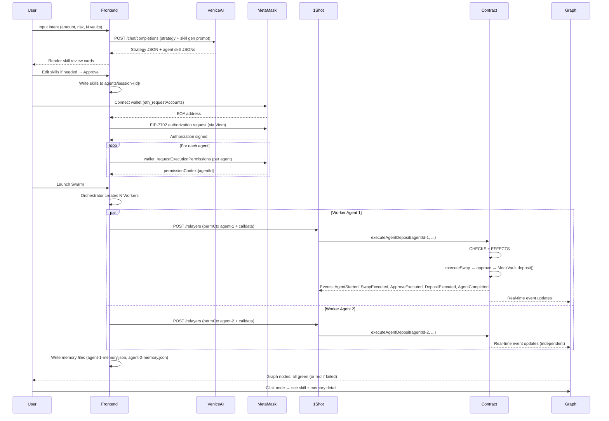

# API & Events — Vibing Farmer

> **Skill Referensi:** api-integration-specialist
> **Versi:** 2.0 | **Tanggal:** 27 Mei 2026
> **Tujuan:** Dokumentasi event model, API endpoints, payload schema, dan error handling

---

## 1. Ringkasan Event Model

Vibing Farmer menggunakan empat sumber API eksternal dan satu sumber event on-chain:

| Sumber | Tipe | Tujuan |
|--------|------|--------|
| Venice AI API | REST (OpenAI-compatible) | Strategy generation + skill auto-generation per agent |
| 1Shot Permissionless Relayer | REST (JSON-RPC) | Gas-free relay untuk semua agent transactions |
| MetaMask Smart Accounts Kit | JSON-RPC via MetaMask Flask | EIP-7702 + ERC-7715 per-agent permission |
| AgentVaultDepositor Events | On-chain (Ethereum logs) | Real-time agent state updates → vis.js graph |

---

## 2. Daftar API & Events

### Venice AI API

**Base URL:** `https://api.venice.ai/api/v1`

| Method | Endpoint | Deskripsi |
|--------|----------|-----------|
| POST | `/chat/completions` | Generate multi-vault strategy + skill sets per agent |
| GET | `/models` | Daftar model tersedia |

**Auth:** Bearer token di header `Authorization: Bearer {VENICE_API_KEY}`.

**Headers wajib:**
```
Content-Type: application/json
Authorization: Bearer {VENICE_API_KEY}
```

---

### 1Shot Permissionless Relayer

**Base URL:** `https://relayer.1shotapi.com`  
**Auth:** Tidak ada API key — Permissionless Relayer.

| Method | Endpoint | Deskripsi |
|--------|----------|-----------|
| POST | `/relayers` | Submit relay request (JSON-RPC) untuk satu agent tx |

**Catatan:** Setiap Worker Agent mengirim relay request sendiri. Relay tidak bisa di-batch untuk multiple agents karena permissionContext berbeda per agent.

---

### MetaMask Smart Accounts Kit (JSON-RPC via window.ethereum)

| Method | Deskripsi |
|--------|-----------|
| `eth_requestAccounts` | Connect wallet + get EOA address |
| `wallet_requestExecutionPermissions` | ERC-7715: request scoped permission per agent |
| `wallet_revokePermissions` | Cabut permission yang sudah di-grant |
| EIP-7702 authorization | Set code untuk EOA via Viem + MetaMask Flask |

---

### Smart Contract Events (`AgentVaultDepositor.sol`)

| Event | Parameters | Trigger | vis.js Update |
|-------|-----------|---------|--------------|
| `AgentStarted` | `agentId`, `user`, `vault` | Agent mulai eksekusi | Node: gray → blue |
| `SwapExecuted` | `agentId`, `user`, `amountIn`, `amountOut` | Swap berhasil | Edge swap confirmed |
| `ApproveExecuted` | `agentId`, `user`, `vault`, `amount` | Approve vault berhasil | Edge approve confirmed |
| `DepositExecuted` | `agentId`, `user`, `vault`, `amount`, `shares` | Deposit berhasil | Edge deposit confirmed |
| `AgentCompleted` | `agentId`, `user`, `vault`, `shares` | Agent selesai semua steps | Node: blue → green |
| `AgentFailed` | `agentId`, `user`, `reason` | Agent gagal (scope violation atau tx error) | Node: any → red |

---

## 3. Payload Schema Lengkap

### Venice AI — Strategy + Skill Generation Request

```json
{
  "model": "llama-3.3-70b",
  "response_format": { "type": "json_object" },
  "venice_parameters": { "include_venice_system_prompt": false },
  "messages": [
    {
      "role": "system",
      "content": "Kamu adalah DeFi strategy coordinator. Generate multi-vault yield farming strategy dan skill configuration untuk setiap agent. Output harus valid JSON sesuai schema yang diberikan. Privacy-first: jangan simpan data user."
    },
    {
      "role": "user",
      "content": "Total: 100 USDC. Risk: Low. Vault count: 2. Memory context dari sesi sebelumnya: [{\"lesson\": \"MockVault A reliable dengan 0.5% slippage\"}]. Generate strategy dan agent skills."
    }
  ],
  "max_tokens": 800
}
```

### Venice AI — Expected Response

```json
{
  "strategy": [
    {
      "vaultAddress": "0xMockVaultA",
      "vaultName": "MockVault USDC-A",
      "amount": "50000000",
      "estimatedAPY": 7.8,
      "reasoning": "Vault A menggunakan strategi lending konservatif. Risk profile sesuai."
    },
    {
      "vaultAddress": "0xMockVaultB",
      "vaultName": "MockVault USDC-B",
      "amount": "50000000",
      "estimatedAPY": 8.2,
      "reasoning": "Vault B historical stable dengan APY lebih tinggi. Risk masih acceptable."
    }
  ],
  "agents": [
    {
      "agentId": "worker-agent-1",
      "vault": "0xMockVaultA",
      "skills": {
        "swap": {
          "maxSlippage": 0.5,
          "dexPreference": "uniswap-v3",
          "maxRetries": 2,
          "timeoutSeconds": 30
        },
        "deposit": {
          "maxAmount": "50000000",
          "vaultAddress": "0xMockVaultA",
          "expiresAt": 1749686400
        }
      }
    },
    {
      "agentId": "worker-agent-2",
      "vault": "0xMockVaultB",
      "skills": {
        "swap": {
          "maxSlippage": 0.3,
          "dexPreference": "uniswap-v3",
          "maxRetries": 2,
          "timeoutSeconds": 30
        },
        "deposit": {
          "maxAmount": "50000000",
          "vaultAddress": "0xMockVaultB",
          "expiresAt": 1749686400
        }
      }
    }
  ]
}
```

---

### ERC-7715 — Permission Request per Agent

```json
{
  "method": "wallet_requestExecutionPermissions",
  "params": {
    "permissions": [
      {
        "type": "vault-deposit",
        "agentId": "0x<keccak256('worker-agent-1')>",
        "allowedVault": "0xMockVaultA",
        "maxAmount": "50000000",
        "currency": "USDC",
        "expiresAt": 1749686400
      }
    ]
  }
}
```

*Note: Panggil 2x — satu per agent. Atau jika MetaMask Flask support batch: kirim array permissions.*

---

### 1Shot Relay — Request per Worker Agent

```json
{
  "jsonrpc": "2.0",
  "method": "relay",
  "params": {
    "permissionContext": "<ERC-7715 context dari MetaMask Flask untuk agentId>",
    "delegationManager": "<address dari MetaMask SAK>",
    "calls": [
      {
        "to": "0xAgentVaultDepositorAddress",
        "data": "<encoded executeAgentDeposit(agentId, user, vault, amount) calldata>",
        "value": "0"
      }
    ]
  },
  "id": 1
}
```

---

### 1Shot Relay — Response

```json
{
  "jsonrpc": "2.0",
  "result": {
    "txHash": "0xTRANSACTION_HASH",
    "status": "pending"
  },
  "id": 1
}
```

---

## 4. Sequence Diagram (Lengkap)



---

## 5. Error Handling & Retry

| Skenario | Handling |
|----------|---------|
| Venice AI timeout (> 10 detik) | Tampilkan hardcoded fallback strategy + skill template. User di-notify. |
| Venice AI JSON malformed | Validasi schema → tampilkan error "Strategy generation failed. Using fallback." |
| MetaMask Flask tidak terinstall | "Install MetaMask Flask 13.9+ untuk melanjutkan." |
| User reject MetaMask popup | Reset UI ke state sebelumnya. |
| 1Shot relay gagal (Worker N) | Worker N: retry 1x sesuai skill maxRetries. Jika masih gagal: Worker N marks failed. Workers lain tidak terdampak. |
| Contract revert (permission exceeded) | Worker marks AgentFailed. Graph node merah. Error detail di memory + node panel. Tidak retry. |
| Worker Agent 1 gagal | Workers 2..N tetap berjalan (Promise.allSettled). Hanya Worker 1 yang failed. |
| Network bukan Sepolia | "Ganti ke Sepolia testnet." |
| vis.js graph tidak load | Fallback ke text-based step tracker list. |

**Retry Policy:**
- Venice AI: tidak ada auto-retry (user trigger manual)
- 1Shot relay per Worker: retry 1x setelah 5 detik jika network error (sesuai skill `maxRetries`)
- Contract revert: tidak ada retry (revert = definitif)
- Worker Agent failure: tidak memengaruhi Workers lain (Promise.allSettled)
