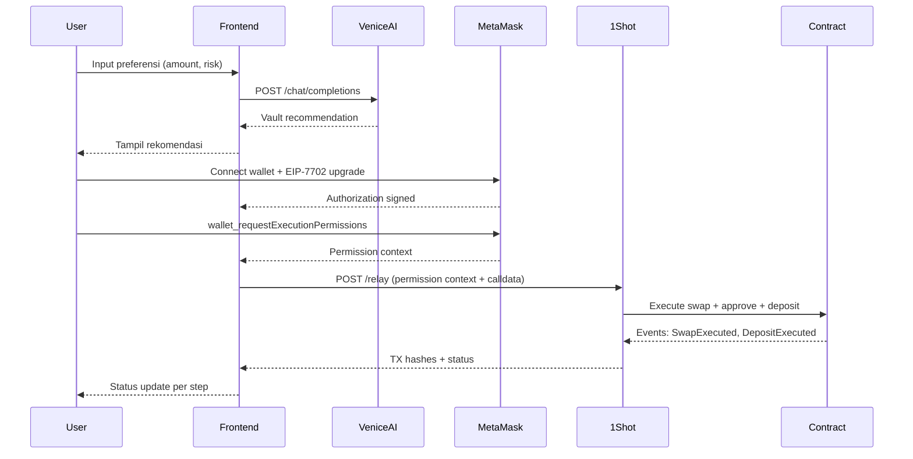

# API & Events — YIELD VIBING

> **Skill Referensi:** api-integration-specialist
> **Versi:** 1.0 | **Tanggal:** 26 Mei 2026
> **Tujuan:** Dokumentasi event model, API endpoints, payload schema, dan error handling

---

## 1. Ringkasan Event Model

YIELD VIBING menggunakan tiga sumber API eksternal dan satu sumber event on-chain:

| Sumber | Tipe | Tujuan |
|--------|------|--------|
| Venice AI API | REST (OpenAI-compatible) | Vault recommendation |
| 1Shot API | REST | Gas-free relay via EIP-7710 |
| MetaMask Smart Accounts Kit | JSON-RPC via MetaMask | EIP-7702 + ERC-7715 |
| Smart Contract Events | On-chain (Ethereum logs) | Konfirmasi deposit |

---

## 2. Daftar API & Events

### Venice AI API

**Base URL:** `https://api.venice.ai/api/v1`

| Method | Endpoint | Deskripsi |
|--------|----------|-----------|
| POST | `/chat/completions` | Generate vault recommendation |
| GET | `/models` | Daftar model tersedia |

**Auth:** Bearer token di header `Authorization`.

---

### 1Shot API

| Method | Endpoint | Deskripsi |
|--------|----------|-----------|
| POST | `/relay` | Submit relay request dengan permission context |
| GET | `/relay/:id` | Cek status relay transaction |

---

### MetaMask Smart Accounts Kit (JSON-RPC)

| Method | Deskripsi |
|--------|-----------|
| `eth_requestAccounts` | Connect wallet |
| `wallet_requestExecutionPermissions` | ERC-7715: request scoped permissions |
| `wallet_revokePermissions` | Cabut permission yang sudah di-grant |
| EIP-7702 authorization | Set code untuk EOA (via kit) |

---

### Smart Contract Events (`VaultDepositor.sol`)

| Event | Parameters | Trigger |
|-------|-----------|---------|
| `PermissionGranted` | `user`, `vault`, `maxAmount`, `expiresAt` | Permission di-set |
| `SwapExecuted` | `user`, `amountIn`, `amountOut` | Swap berhasil |
| `DepositExecuted` | `user`, `vault`, `amount`, `shares` | Deposit berhasil |
| `PermissionRevoked` | `user`, `vault` | Permission dicabut |
| `ExecutionFailed` | `user`, `reason` | Scope violation |

---

## 3. Payload Schema Ringkas

### Venice AI — Request

```json
{
  "model": "llama-3.3-70b",
  "messages": [
    {
      "role": "system",
      "content": "Kamu adalah advisor DeFi yang privacy-first. Rekomendasikan vault terbaik."
    },
    {
      "role": "user",
      "content": "Saya punya 100 USDC, risk level: Low. Vault mana yang paling cocok?"
    }
  ],
  "max_tokens": 300
}
```

### ERC-7715 — Permission Request

```json
{
  "method": "wallet_requestExecutionPermissions",
  "params": {
    "permissions": [
      {
        "type": "vault-deposit",
        "allowedVault": "0xMockVaultAddress",
        "maxAmount": "100000000",
        "currency": "USDC",
        "expiresAt": 1749686400
      }
    ]
  }
}
```

### 1Shot Relay — Request

```json
{
  "permissionContext": "<ERC-7715 context dari wallet>",
  "calls": [
    {
      "to": "0xVaultDepositorAddress",
      "data": "<encoded swap + deposit calldata>",
      "value": "0"
    }
  ]
}
```

---

## 4. Alur Publish & Subscribe



---

## 5. Error Handling & Retry

| Skenario | Handling |
|----------|---------|
| Venice AI timeout (> 10 detik) | Error: "AI tidak merespons. Coba lagi." Tidak auto-retry. |
| Venice AI 4xx/5xx | Tampilkan error message dari respons. |
| MetaMask tidak terinstall | "Install MetaMask untuk melanjutkan." |
| User reject MetaMask popup | Reset UI ke state sebelumnya. |
| 1Shot relay gagal | "Relay gagal. Coba lagi." Retry manual. |
| Contract revert (permission exceeded) | "Eksekusi ditolak: melebihi batas permission." Tidak retry. |
| Network bukan Sepolia | "Ganti ke Sepolia testnet." |

**Retry Policy:**
- Venice AI: tidak ada auto-retry (user trigger manual)
- 1Shot relay: 1x auto-retry setelah 5 detik jika network error
- Contract revert: tidak ada retry (revert = definitif)
